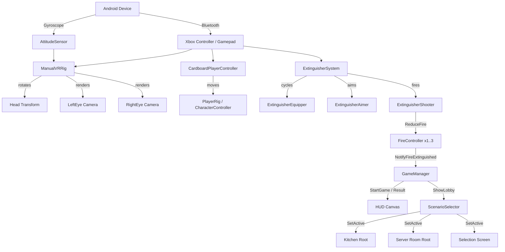
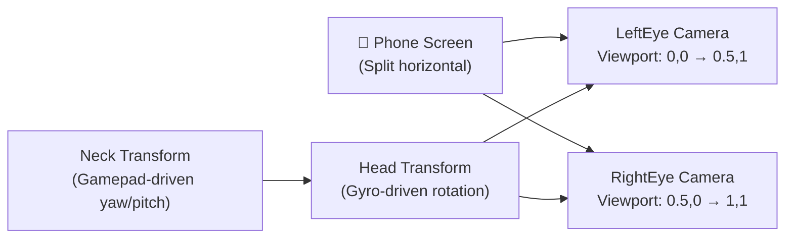
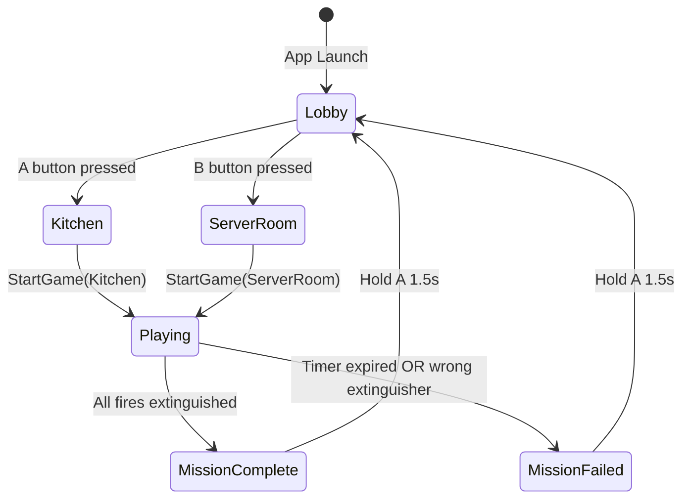
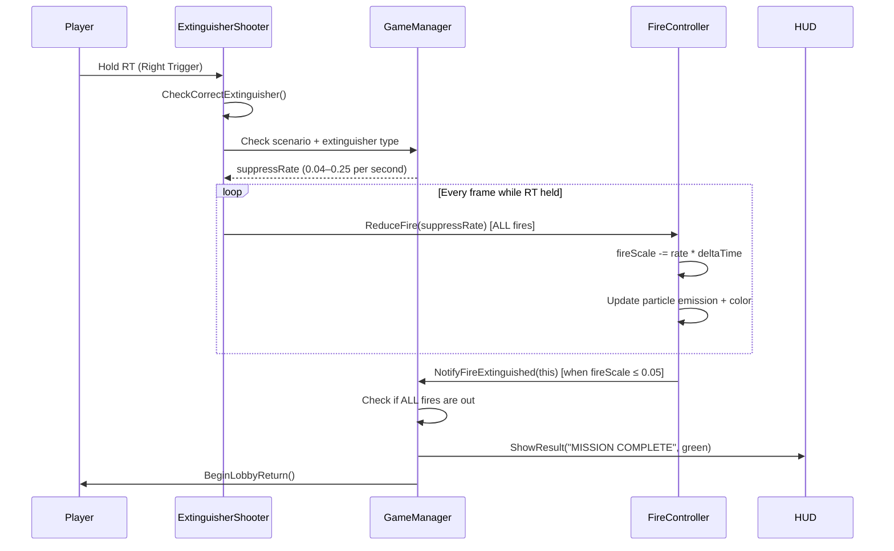
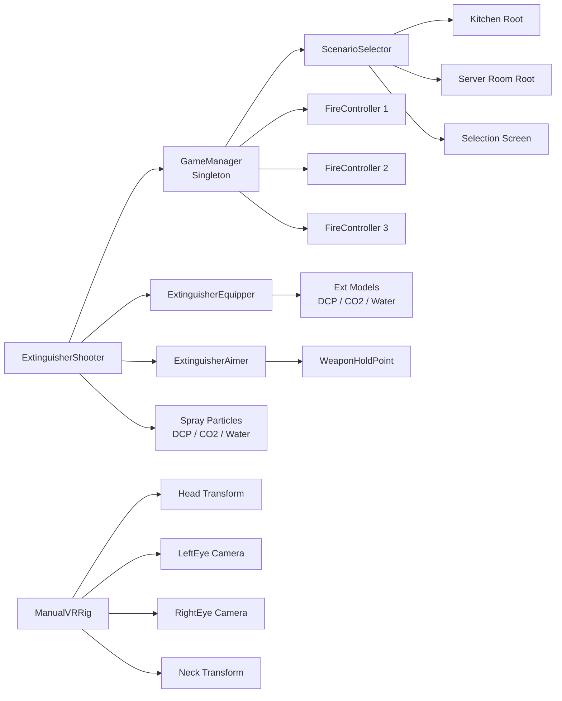

# Architecture — VR Firefighter Training Game

## Overview

The game is a single-scene Unity application with no scene loading between states. All game objects for both scenarios exist in the one scene (`NewRealSCE.unity`) and are toggled active/inactive via `ScenarioSelector` and `GameManager`.

---

## System Architecture Diagram



---

## VR Rendering Architecture

The app does **not** use any XR Plugin or Google Cardboard SDK. It uses a custom `ManualVRRig` to implement stereoscopic rendering.



**Eye offset:** ±0.032m (64mm IPD) on the X axis, applied to each camera's local position.

**Gyroscope pipeline:**
```
AttitudeSensor.current.attitude.ReadValue()
    → flip handedness: (x, y, -z, -w)
    → apply Euler(90, 0, 0) [LandscapeLeft correction]
    → multiply by _gyroOffset [recenter]
    → Slerp smooth
    → Head.localRotation
```

---

## Game State Machine



---

## Fire Suppression System



---

## Component Dependency Map



---

## Directory Structure

```
Assets/
├── Editor/                         ← Editor-only tools (not in build)
│   ├── ExtinguisherModelBuilder.cs ← Rebuild weapon hierarchy + wire scripts
│   ├── SetupManualVRRig.cs         ← Build stereo VR camera rig
│   ├── MissingScriptCleaner.cs     ← Remove null MonoBehaviour refs
│   ├── GameLogicWirer.cs           ← Wire HUD / GameManager refs
│   ├── KitchenBuilder.cs           ← Procedural kitchen environment
│   ├── ServerRoomBuilder.cs        ← Procedural server room environment
│   ├── HUDBuilder.cs               ← Build HUD canvas hierarchy
│   ├── MaterialFixer.cs            ← Fix URP material assignments
│   └── SceneBinaryIsolator.cs      ← Binary search corruption tool
│
├── Scripts/                        ← Runtime MonoBehaviours
│   ├── ManualVRRig.cs              ← Stereo render + gyro + gamepad look
│   ├── CardboardPlayerController.cs← Left-stick movement
│   ├── GameManager.cs              ← Singleton game state manager
│   ├── ExtinguisherSystem.cs       ← ExtinguisherEquipper + Aimer + Shooter
│   ├── FireController.cs           ← Per-fire particle + scale controller
│   ├── ScenarioSelector.cs         ← Lobby input + scenario activation
│   ├── PermissionGranter.cs        ← Android camera permission + orientation lock
│   ├── Billboard.cs                ← Always-face-camera utility
│   └── CardboardInitializer.cs     ← No-op stub (legacy, safe to keep)
│
├── Materials/                      ← URP Lit materials
├── Scenes/
│   └── NewRealSCE.unity            ← Single master scene
└── Plugins/Android/                ← AndroidManifest + Gradle overrides
```
