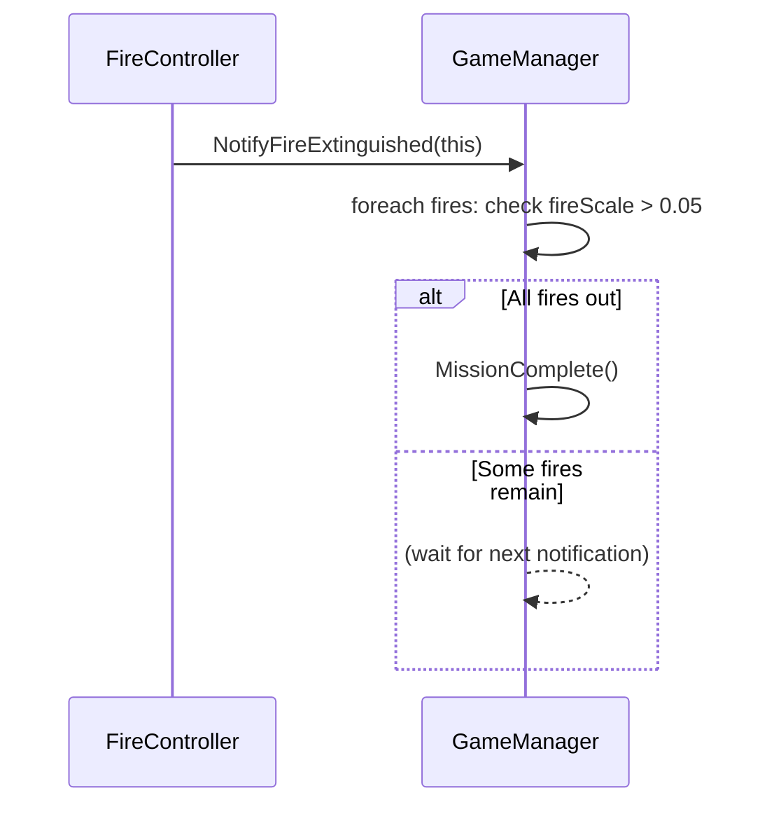

# Design Patterns — VR Firefighter Training Game

This document describes the software design patterns applied throughout the codebase.

---

## 1. Singleton — `GameManager`

**Location:** `Assets/Scripts/GameManager.cs`

`GameManager` is implemented as a classic Unity Singleton — only one instance exists globally and is accessible via `GameManager.Instance`.

```csharp
public class GameManager : MonoBehaviour
{
    public static GameManager Instance;

    void Awake()
    {
        if (Instance == null) Instance = this;
        else Destroy(gameObject);  // destroy duplicates
    }
}
```

**Why:** All game systems (FireController, ExtinguisherShooter, ScenarioSelector) need to read/write shared game state (active scenario, timer, extinguisher type, win/fail state). A singleton avoids passing references through every component.

**Trade-offs:** Tightly couples all systems to GameManager. Acceptable for a 12-hour prototype scope.

---

## 2. Observer-like Notification — `NotifyFireExtinguished`

**Location:** `FireController.cs` → `GameManager.NotifyFireExtinguished(this)`

Instead of GameManager polling all fires every frame, each `FireController` notifies the manager when its fire reaches zero. GameManager then checks if _all_ fires are extinguished.



**Why:** Avoids O(n) polling in GameManager.Update() every frame. Each fire self-reports when it's done.

---

## 3. Command Pattern — Extinguisher Input

**Location:** `Assets/Scripts/ExtinguisherSystem.cs`

Three MonoBehaviours act as discrete command handlers for controller input:

| Class | Responsibility | Trigger |
|---|---|---|
| `ExtinguisherEquipper` | Cycle active extinguisher model | Y button |
| `ExtinguisherAimer` | Animate weapon idle ↔ aim position | LT |
| `ExtinguisherShooter` | Fire suppression logic + particles | RT |

Each reads `Gamepad.current` independently, keeping concerns fully separated with no cross-coupling except `ExtinguisherShooter` reading `Equipper` for the current type.

---

## 4. Strategy Pattern — Suppression Rate

**Location:** `ExtinguisherShooter.ApplyFireSuppression()`

The suppression rate varies dynamically based on scenario + extinguisher type combination:

```csharp
float suppressRate = 0f;
if (scenario == Kitchen)
{
    if (ext == DCP)   suppressRate = 0.25f;  // correct — fast
    if (ext == CO2)   suppressRate = 0.03f;  // wrong type — slow
    if (ext == Water) suppressRate = 0.01f;  // very wrong — almost no effect
}
else if (scenario == ServerRoom)
{
    if (ext == CO2) suppressRate = 0.25f;  // correct — fast
    if (ext == DCP) suppressRate = 0.04f;  // wrong — slow
    if (ext == Water) → InstantFail()      // dangerous — electrocution
}
```

This acts as a switchable strategy: the algorithm for "how fast does fire go out" changes based on runtime context — teaching the correct extinguisher choice through performance difference.

---

## 5. Template Method — Fire Visual Update

**Location:** `FireController.Update()`

`FireController.Update()` is a fixed template that runs every frame:
1. Scale the fire GameObject
2. Update particle emission rate proportional to `fireScale`
3. Interpolate flame color (orange → dark red as fire dies)
4. Scale particle size
5. Stop particles when `fireScale ≤ 0.05`
6. Notify GameManager when extinguished

Any subclass could override individual steps, but the overall update sequence is invariant.

---

## 6. Facade — Editor Tool Menu

**Location:** `Assets/Editor/` (all `[MenuItem]` scripts)

The Unity Editor menu `VR Firefighter →` exposes a simplified interface to a complex set of scene manipulation operations:

```
VR Firefighter/
├── Build Extinguisher Models + Wire Scripts  ← façade for 10+ internal steps
├── Remove Missing Scripts                    ← façade for GameObjectUtility scan
├── Setup Manual VR Rig                       ← façade for camera hierarchy build
└── Wire Entire Scene                         ← façade for all ref wiring
```

Each MenuItem is a facade hiding `SerializedObject`, `Undo`, `EditorUtility.SetDirty`, and `PrefabUtility` complexity from the developer workflow.

---

## 7. Component / Composition Over Inheritance

The entire extinguisher system uses Unity's built-in component model — no inheritance chains:

```
PlayerRig GameObject
├── ExtinguisherEquipper  (MonoBehaviour)
├── ExtinguisherAimer     (MonoBehaviour)
└── ExtinguisherShooter   (MonoBehaviour)
```

`ExtinguisherShooter` holds a reference to `ExtinguisherAimer` and `ExtinguisherEquipper` — it reads their public state rather than calling inherited methods. This keeps each component testable and replaceable independently.

---

## 8. Idempotent Builder Pattern

**Location:** `ExtinguisherModelBuilder.cs`, `SetupManualVRRig.cs`

All Editor builder scripts are **idempotent** — running them multiple times produces the same result with no accumulation of duplicate objects:

```csharp
// Pattern used in every builder step:
var existing = parentTransform.Find("WeaponHoldPoint");
if (existing != null) Undo.DestroyObjectImmediate(existing.gameObject);

var fresh = new GameObject("WeaponHoldPoint");
fresh.transform.SetParent(parentTransform, false);
```

**Why critical:** Unity Editors are run manually and can be run repeatedly by mistake. Idempotency prevents "ghost" duplicates accumulating in the scene, which was the root cause of the original `CachedReader::OutOfBoundsError` crash.

---

## 9. Null Object / Graceful Degradation

Throughout the codebase, null checks are paired with informative log messages rather than silent returns:

```csharp
// Bad (silent failure):
if (resultText == null) return;

// Good (actionable warning):
if (resultText == null)
{
    Debug.LogWarning("[GameManager] resultText is null. Run VR Firefighter → Wire Entire Scene.");
    return;
}
```

Also: `if (Gamepad.current == null) return;` guards in every Update() method that reads controller input — required by the New Input System API contract.
